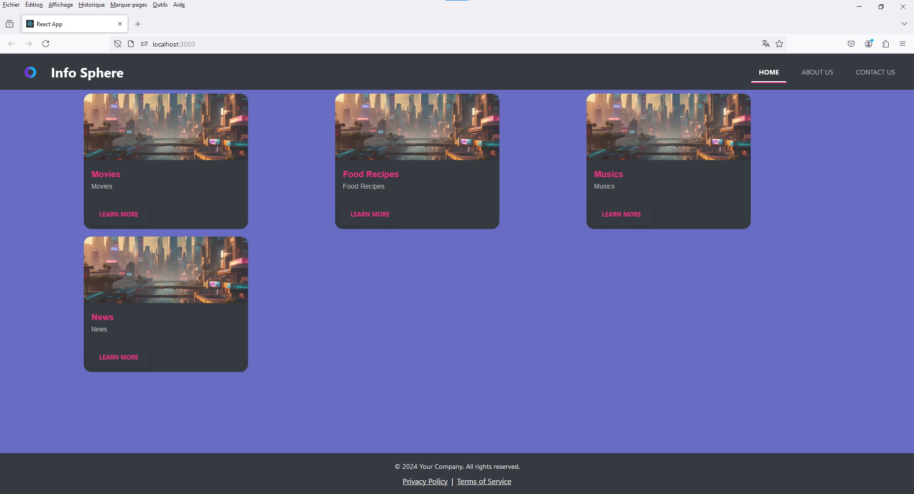
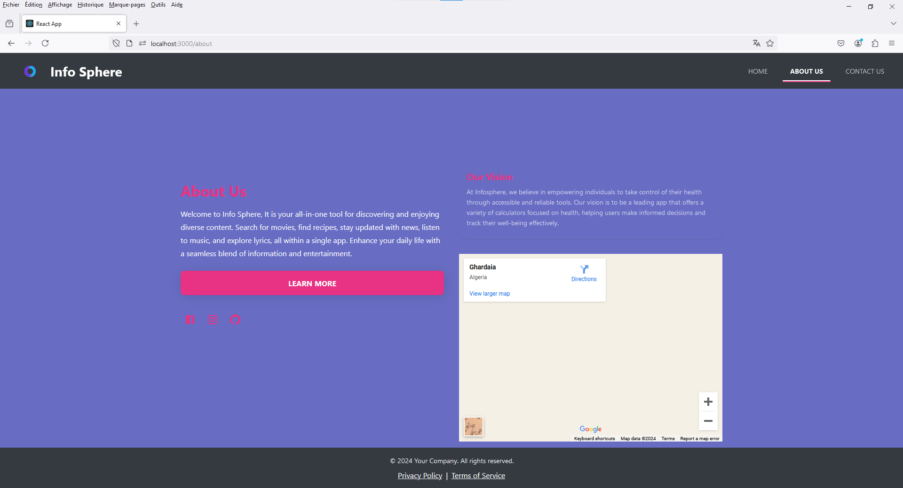
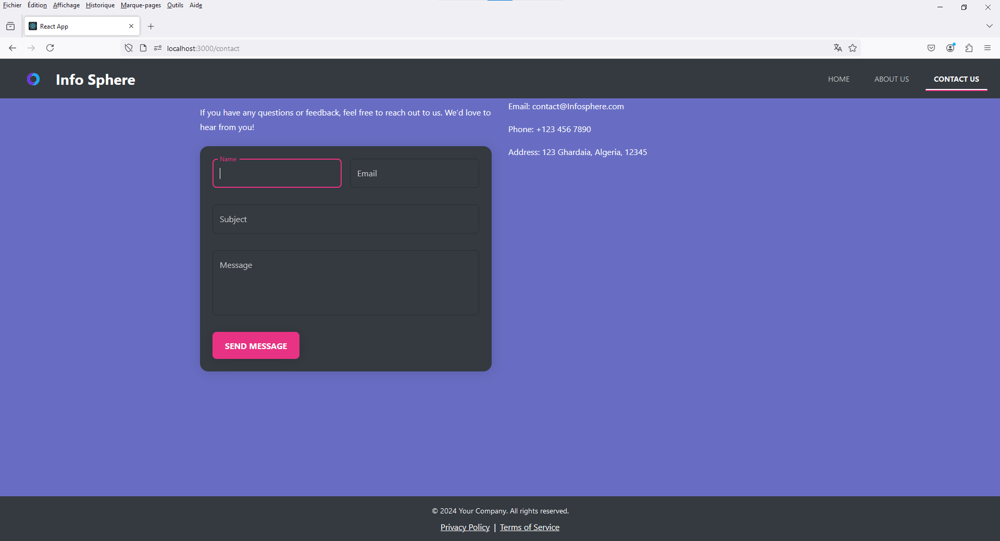
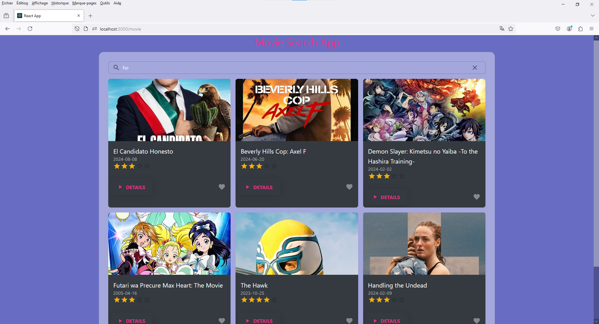
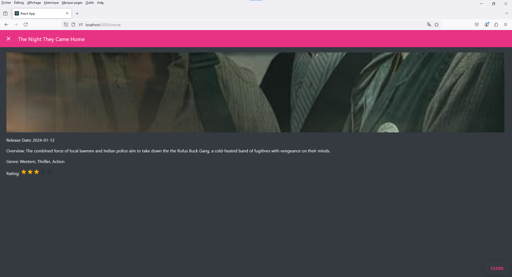
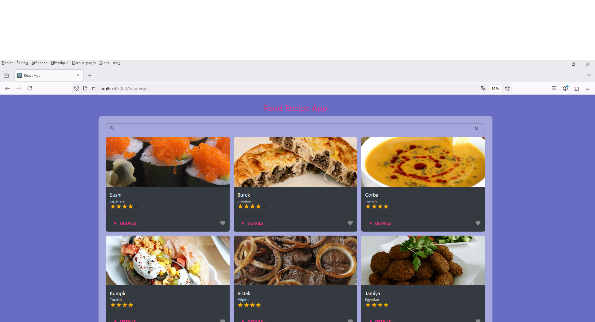
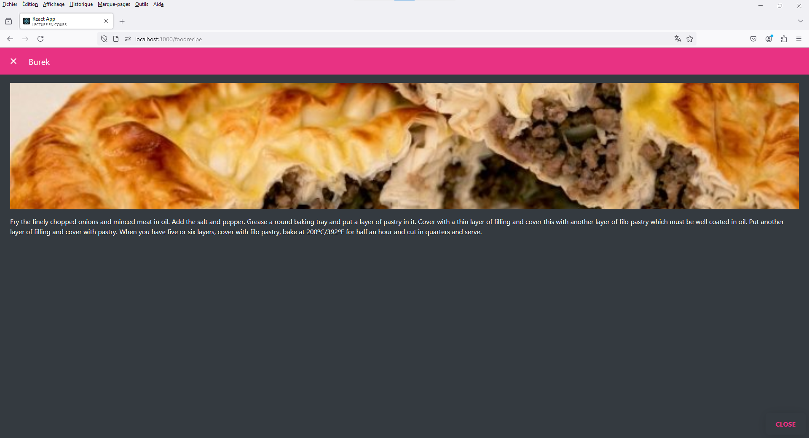
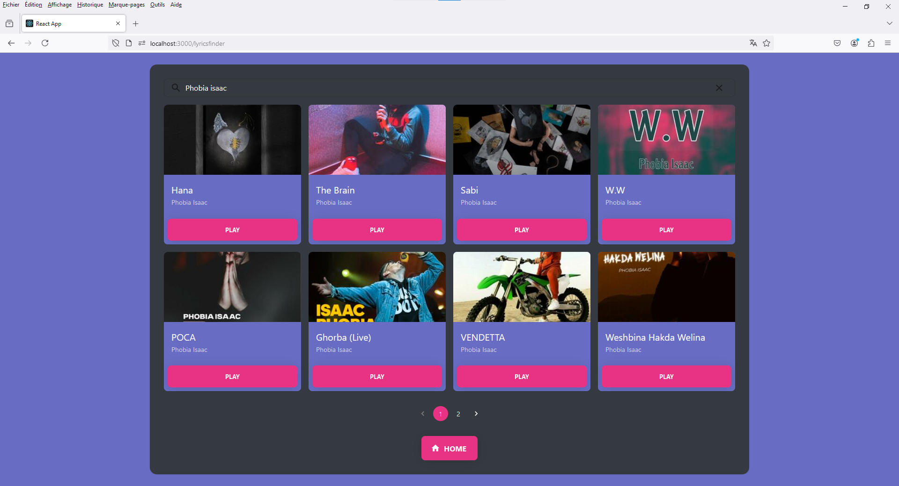
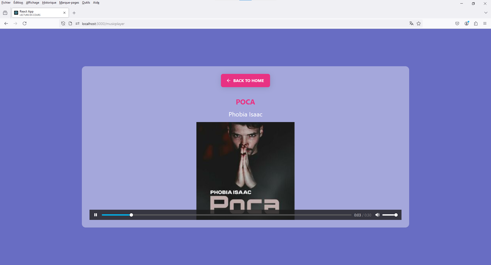

# InfoSphere

InfoSphere is your all-in-one tool for discovering and enjoying diverse content. Search for movies, find recipes, stay updated with news, listen to music, and explore lyrics, all within a single app. Enhance your daily life with a seamless blend of information and entertainment.

## Screenshots




*Home screen showcasing the diverse content available in InfoSphere.*







*Search for movies and get detailed information.*


*Discover new recipes and save your favorites.*

## Features

- Search for movies and get detailed information, ratings, and reviews.
- Find delicious recipes with step-by-step instructions.
- Stay updated with the latest news from multiple sources.
- Listen to music and discover lyrics for your favorite songs.
- User-friendly interface with a smooth, integrated experience.

## Installation

To run this project locally, follow these steps:

1. Clone the repository:
    ```bash
    git clone https://github.com/idrissziadi/Info-Sphere.git
    cd Info-Sphere
    ```

2. Install dependencies:
    ```bash
    npm install
    ```

3. Start the development server:
    ```bash
    npm start
    ```

Your app will be running at `http://localhost:3000`.

## Usage

Explore the different sections of the app to search for movies, find recipes, read the latest news, listen to music, and more. Enjoy a seamless experience navigating between content types.

## Contributing

Contributions are welcome! Please fork the repository and submit a pull request with your changes. Ensure your code follows the existing style and includes relevant tests.

## License

This project is licensed under the MIT License - see the [LICENSE](LICENSE) file for details.

## Contact

For any questions or feedback, feel free to reach out:
- Email: idriss.ziadi47@gmail.com
- GitHub: [your-username](https://github.com/idrissziadi)

## Technologies Used

- React
- JavaScript (ES6+)
- HTML/CSS
- Material UI
- APIs for Movies, News, Music, and Recipes

